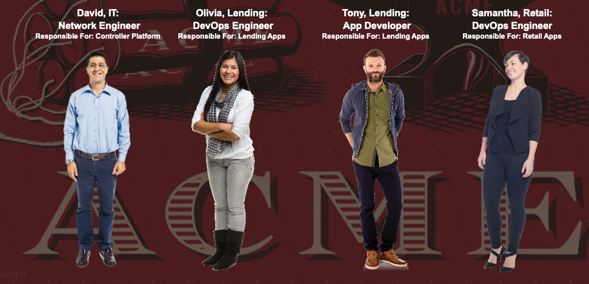

========================
The ACME Financial story
========================

+---------------------------------------------------------------------------------------------+
| Talk Track                                                                                  |
+=============================================================================================+
| ACME Financial was founded in 1965.                                                         |
| In the 1980's during the American recession, ACME Financial spun off a lending division to  |
| provide better service for  customers.                                                      |
| The new Lending business unit was successful during the recovery following the recession,   |
| and grew to become a key part of the ACME Financial portfolio.                              |
| In 2001 the Lending business unit expanded into the retail personal finance space.          |
| In 2020 this retail space is building a new trading platform for customers.                 |
| In this exercise we'll be working with the lending business unit, as well as some of the    |
| people supporting the retail area in particular.                                            |
+---------------------------------------------------------------------------------------------+
| - **David** is a *network engineer*: he's responsible for the overall NGINX Controller      |
|   platform, and for core network routing and related security in the Lending business unit. |
| - **Olivia** is a *DevOps engineer*: she's responsible for curating the CI/CD pipelines and |
|   for NGINX configuration.                                                                  |
| - **Tony** is an *application developer*: he's responsible for parts of the core service    |
|   center application.                                                                       |
| - **Samantha** is a *DevOps engineer*: she's responsible for DevOps pipelines as well as    |
|   getting trading and other new apps to market.                                             |
+---------------------------------------------------------------------------------------------+

