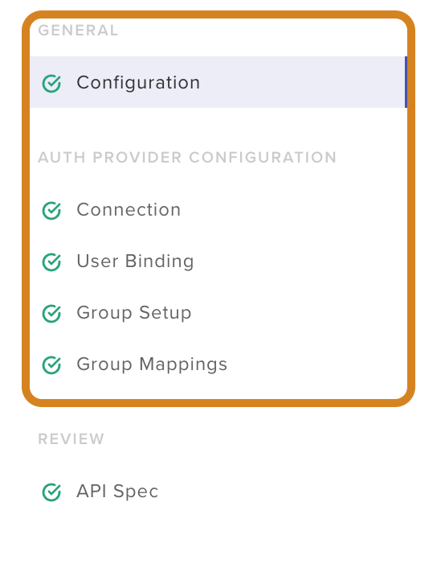

Lab 1 - Active Directory Authentication
#################################################

The goal of this lab is to explore the pre-configured Active Directory authentication
and role based access control configuration. Students will view the existing configuration without making changes.

.. IMPORTANT::
    Estimated completion time: 5 minutes

.. NOTE::
    Lab instructions are written as if the student is executing the steps
    from the Windows jumphost -- ``jumphost-1``. See the :ref:`overview` for connection details.

Access the Authentication Providers Configuration
--------------------------------------------------

#. Open Chrome Browser.
#. Access the NGINX Controller UI through the provided bookmark.

   .. image:: ./media/M1L1ControllerBookmark.png
      :width: 400

#. Login with the ``Peter Parker`` account who is an NGINX Controller admin.

   +-------------------------+-----------------+
   |      Username           |    Password     |
   +=========================+=================+
   | peter@acmefinancial.net | ``Peter123!@#`` |
   +-------------------------+-----------------+

   .. image:: ./media/M1L1ControllerLogin.png
      :width: 400

#. Select the navigation bar in the upper left of the screen then select **Platform** from the drop-down list.

   .. image:: ./media/M1L1Platform.png
      :width: 200

#. Navigate to the **Auth Providers** tile.

   .. image:: ./media/M1L1AuthProviders.png
      :width: 800

#. View the configuration of the ``ad-acmefinancial-net`` provider by clicking **Edit**.

   .. image:: ./media/M1L1ProviderEdit.png
      :width: 800

Inspect the Authentication Provider Configuration
--------------------------------------------------

In this section, students will walk through the "Authentication Provider Configuration" tabs.
Click the tab for the relevant area.

#. **Configuration** tab

   This section defines the basic settings for the authentication provider.  The required parameters are:

   +--------------------+---------------------------------------------------------------------------------------+
   | Attribute          | Description                                                                           |
   +====================+=======================================================================================+
   | Auth Provider Type | Define the  authentication provider being used                                        |
   +--------------------+---------------------------------------------------------------------------------------+
   | User Format        | Define if the user will login with username@domain (UPN) or domain/user (User Domain) |
   +--------------------+---------------------------------------------------------------------------------------+

   .. NOTE::
      As of release 3.15, Active Directory is currently the only supported Auth Provider Type.

   .. image:: ./media/M1L1ProviderConfig.png
      :width: 800

#. **Connection** tab

   This section is used to specify the Domain, URL, and SSL settings.  

   .. NOTE::
        There is no option under **SSL Parameters** to allow for an unencrypted connection. 

   In this example, the AD certificate has been provided for verification purposes. 

   .. image:: ./media/M1L1Connection.png
      :width: 800

#. **User Binding** tab

   This section specifies the "Bind" account credentials for NGINX Controller to authenticate to Active Directory.

   .. image:: ./media/M1L1UserBinding.png
      :width: 800

#. **Group Setup** tab

   This section determines the caching and query parameters for Active Directory groups which can be used for Role Based Access Control.

   .. image:: ./media/M1L1GroupSetup.png
      :width: 800

#. **Group Mappings** tab

This section maps Active Directory groups to "Internal" NGINX Controller "Roles Groups".

   .. image:: ./media/M1L1GroupMappings.png
      :width: 800

Controller "Roles Groups" can be configured under **Platform** -> **Roles**. 
See the NGINX Controller documentation on managing `roles`_ for more information.

   .. image:: ./media/M1L1RolesGroups.png
      :width: 800

The Active Directory groups used in the **Group Mapping** configuration can be viewed on the Domain Controller. 

   .. NOTE::
     The following pictures are for reference -- you don't need to login to the Domain Controller.

   .. image:: ./media/M1L1ADGroups.png
      :width: 800

   .. NOTE::
     You are currently logged in as "Peter Parker". "Peter" is member of "nginx-controller-admins".  This Active Directory group is mapped to the "admin_group" roles group in NGINX Controller. 

   .. image:: ./media/M1L1ADUsers.png
      :width: 600

   .. image:: ./media/M1L1ADControllerAdmins.png
      :width: 400

Additional Reference
--------------------

The published NGINX Controller documentation walks through configuring an Active Directory authentication provider in `detail`_.

.. _detail: https://docs.nginx.com/nginx-controller/platform/access-management/manage-active-directory-auth-provider/
.. _roles: https://docs.nginx.com/nginx-controller/platform/access-management/manage-roles/
