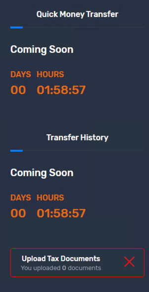
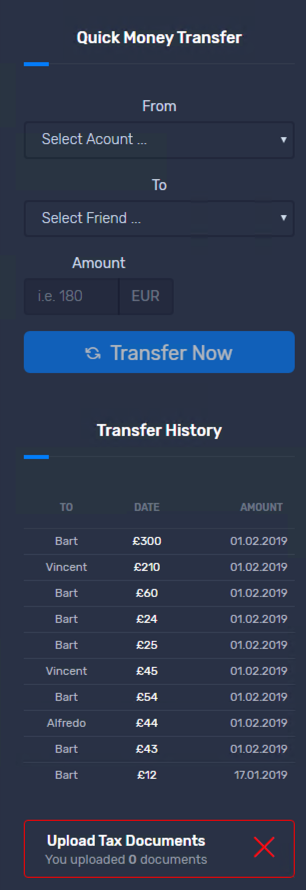
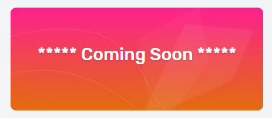
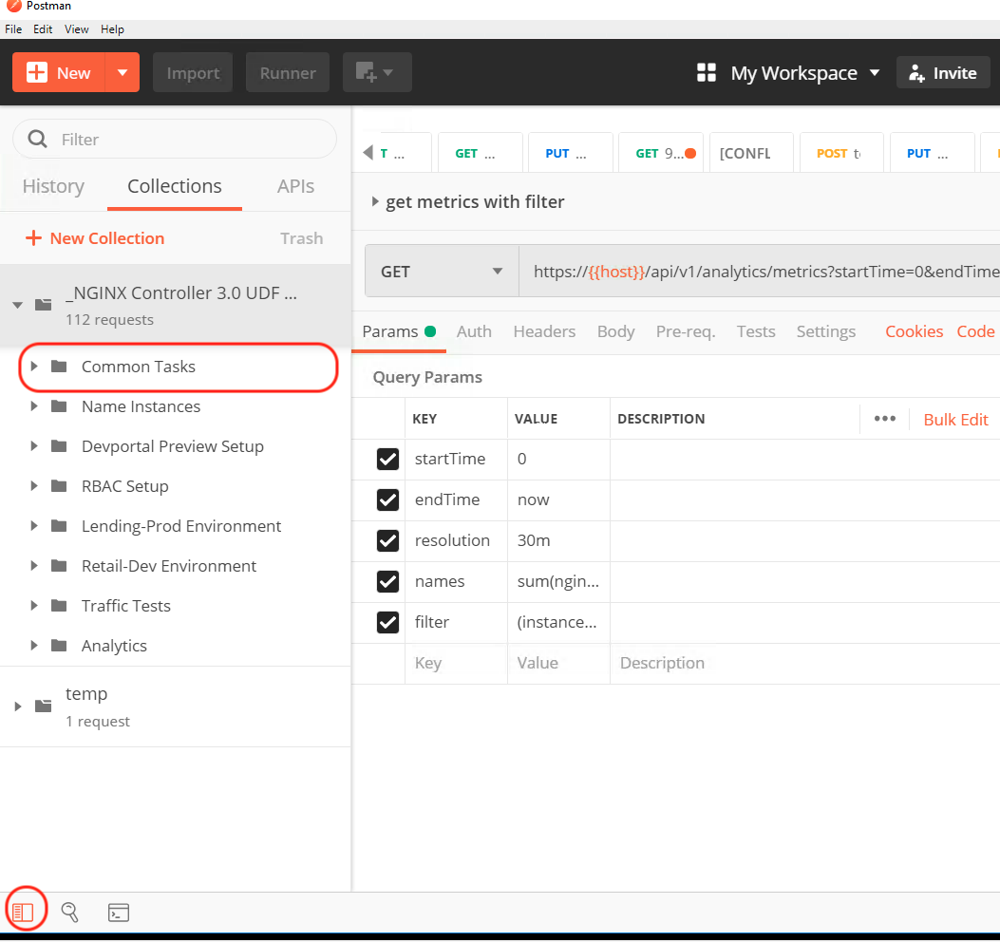

==============================================================================
Extending the Trading application by exposing referral and upload capabilities
==============================================================================

Using the GUI
=============

Samantha is responsible for the trading application. She has found that it's been extremely successful and adopted quickly by the retail customers.
App teams are rolling out new parts of the application using modern application development processes. We are going to deploy some new capabilities for this application. We will add 
the ability to transfer funds, a referral program and the ability to upload documents. So let's go ahead and begin these changes.

Explore the trading application
^^^^^^^^^^^^^^^^^^^^^^^^^^^^^^^

    1. Using Google Chrome on the Jumpbox, open a new tab
    2. Enter `https://trading.dev.acmefinancial.net` as the URL
    3. Select `Login`
    4. enter the credentials:

      - username: `admin`
      - password: `iloveblue`
      
    5. Note the dashboard. As we enable new features the dashboard will change, displaying these new capabilities.

|trading_transfer_before|

Define a new Transfers Component of the trading.acmefinancial.net application (Withing the retail-dev environment)
^^^^^^^^^^^^^^^^^^^^^^^^^^^^^^^^^^^^^^^^^^^^^^^^^^^^^^^^^^^^^^^^^^^^^^^^^^^^^^^^^^^^^^^^^^^^^^^^^^^^^^^^^^^^^^^^^^

    1. In the Controller GUI return to the `Apps` section
    2. Select the App `trading.acmefinancial.net`
    3. Select the `View` icon |icon| to see the full list of Components for the App
    
    .. |icon| image:: ../../_static/view.png

    4. Select `Create Component` 
    
    .. image:: ../../_static/create_component.png

    5. enter the name: `trading-transfers`
    6. enter the display name: `Trading Transfers Component`
    7. Select Next
    8. Select the Gateway: `trading.acmefinancial.net`
    9. Select Next
    10. Click the `Add URI` link on the upper right. Enter the URI: `/api`
    11. Select Next (skipping `Methods`, and `Advanced sections`)
    12. Click the `Add Workload Group` link in the upper right and enter a new group name: `app2-servers`
    13. Add Backend Workload URI: `http://10.1.20.21:9804`. Click `Done`.
    14. Select `Publish` to create the transfers capability.     
    
    .. image:: ../../_static/publish.png
    
    15. Observe the Status of the Component change from `Configuring` to `Configured` to indicate it is live.     
    
    .. image:: ../../_static/configuring.png
    
|trading_transfer_after|

David is responsible for the network and certificate management across business units within the organization. David’s team established the trading gateway for Samantha to support this new component.
The Controller UI is both flexible and powerful for various scenarios or use cases, whether it’s basic URI routing, SNI routing, or a combination. This example happened to be a very basic URI routing use case. 

The objective of this component is to route to the servers on which the code runs: the workload group. A workload group is a collection of servers or upstreams.
Controller is responsible for applying the configuration specified via the GUI or the API, and realizing it at the actual NGINX instance to process traffic.

Review the new section of the Trading application
^^^^^^^^^^^^^^^^^^^^^^^^^^^^^^^^^^^^^^^^^^^^^^^^^^^^

    1. Return to the trading application browser tab and refresh the page
    2. Note the new capability that has been added to the right hand side of the application.

Very quickly, you were able to establish a new traffic path configuration and didn't have to directly configure an NGINX instance or understand nginx.conf syntax. Through monitoring and analytics you can see this new component capable of adding value to the business and business unit.

Using the API
=============

Now, this is great. Samantha explored Controller and discovered what she can do the GUI.  But most likely she is going to move forward to enabling her pipeline(s) with these steps and configurations into her pipeline.  We are now going to open a pipeline tool that Olivia might use and extend the trading application using the API.

Login as Samantha using the API
^^^^^^^^^^^^^^^^^^^^^^^^^^^^^^^^^^

    1. From the desktop open Postman
    2. the Collection `NGINX Controller 3.0 UDF Demo & Lab` should already be loaded
    3. Open the `Common Tasks` section 
    
 |open|
 
    4. Select `Login to Controller - retail dev`
 
 |login|
    
    5. Select `Send`

      You are now logged into the API as Samantha.  Controller returned a cookie that will be used for authenticating then executing the following commands.

Enable the Referrals capability
^^^^^^^^^^^^^^^^^^^^^^^^^^^^^^^^^^

    1. In Postman open the section `Retail-Dev Environment`
    2. open the `Application - trading.acmefinancial.com` section
    3. Select `Create Comp - trading - referrals`
    4. In the right hand frame of Postman, select the `Body` tab
    5. Review the JSON
    6. Click `Send`
    7. Change the method to "GET" and click `Send` again
    8. View the status of the configuration being applied in the `currentStatus` section and that the `selfConfigState` is in "configuring"
    9. Repeat the GET until "configured" equals "1"

      Controller follows an API first methodology which means that the GUI is using the same APIs as you are.
      In our previous Postman PUT request's body you can see the desiredState of ingress (the incoming URI) and backend (the workloadGroups and servers).
      Through the GET you can see the eventually consistent behavior of the system as the configuration is then built and applied to the referenced NGINX instances.

Review the new section of the Trading application
^^^^^^^^^^^^^^^^^^^^^^^^^^^^^^^^^^^^^^^^^^^^^^^^^^^^

    1. Return to the trading application browser tab and *refresh the page* (from the Jumphost)
    2. Note the new |referrals| capability that has been added to the application.  Previously there was a |coming_soon| placeholder.

.. |referrals| image:: ../../_static/referrals.png
    :scale: 40 %
    

 .. |login| image:: ../../_static/postman_login.png

