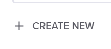

===================================================
Adding a gateway for the mobile trading application
===================================================

The trading application has been a great product with a web browser GUI. 
The business unit wants to expand this to a new mobile application so that ACME 
Financial retail customers can do trades on the go.
To enable a new mobile API for customers ACME Financial needs to expose a 
brand new gateway 
to the public Internet for Samantha's mobile application to receive API calls.
Within ACME Financial the request workflow requires David to get involved when 
any new endpoint is exposed to the public Internet and to ensure security for API
calls coming into the bank. Samantha will partner with David to ask for a new gateway 
with a new certificate
to make sure that trading API interactions are secure.
Let's work through the process of David establishing a new gateway for Samantha.

Add a Gateway using the GUI
^^^^^^^^^^^^^^^^^^^^^^^^^^^^^^

    1. Select the Controller GUI tab in Chrome on the Jumphost. Verify you are logged in as `admin` using the credentials:

      - username: `admin@acmefinancial.net`
      - password:  `Admin123!@#`
      
    2. Select the `Services` menu from the navigation bar
    3. Select `Gateways`
    4. Select |create|
    5. Enter the Name: `trading-api.acmefinancial.net`
    6. Select the environment:  `Retail Dev`
    7. Select `Next`
    8. Select the Instance Reference: `dev-nginx-1`
    9. Select `Next`
    10. Add the URI: `https://trading-api.acmefinancial.net`
    11. Select `Done`
    12. For the Certificate Reference, select |createNew|
    13. Name the new certificate: `trading-api.acmefinancial.net`
    14. Browse to the trading-api.dev.acmefinancial.net.crt certificate (it's in your jumphost,  in Documents > Certs)
    15. Browse to the trading-api.dev.acmefinancial.net.key key (it's in your jumphost,  in Documents > Certs)
    16. Select `Submit` to create the new certificate
    17. Select `Next`
    18. Select `Next`
    19. Select `Publish`
    20. Note that the Gateway progresses from a state of "configuring" to "configured".

Certificates (PEM or PKCS12) can be imported into Controller at the time they are added to a Gateway or Component, they can be defined and managed separately (such as by a unique certificate team) and only referenced, or a file path local to the NGINX instance can be defined.  These options give unique flexibility to David and Samantha in best meeting how they want to manage their certificates.

