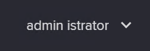
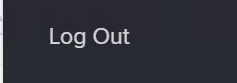
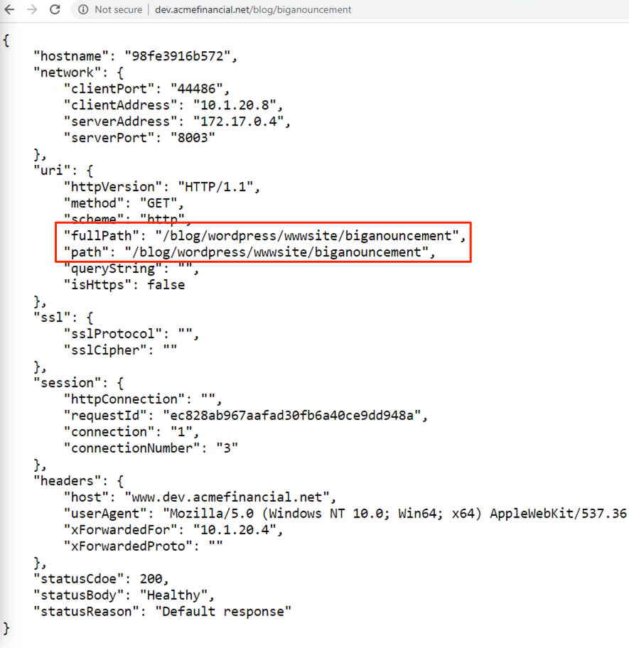

==============================================
Add a blog Component to www.acmefinancial.net
==============================================

+---------------------------------------------------------------------------------------------+
| Talk Track                                                                                  |
+=============================================================================================+
| Samantha wants to expand on the marketing sites promoting ACME Financial technology. She    |
| wants to build a new app component for the acme financial app - a blog.                     |
| This will allow her team to start blogging about the trading app, to spark interest and     |
| connection with their customers.                                                            |
| Let's take a look at additional feature functionality in the URI rewrite use case.          |
+---------------------------------------------------------------------------------------------+

Log out as David
^^^^^^^^^^^^^^^^^^^

    1. Returning to the Controller GUI
    2. Select |admin| in the top right
    3. Select |logout|

Log in as Samantha
^^^^^^^^^^^^^^^^^^^^^

    1. Login as Samantha using the credentials:
    
      - username: `retail-dev@acmefinancial.net`
      - password: `Admin123!@#`

Review the Components added through the API
^^^^^^^^^^^^^^^^^^^^^^^^^^^^^^^^^^^^^^^^^^

    1. Select `Services` from the navigation menu
    2. Select `Apps`
    3. Select `trading.acmefinancial.net`
    4. Review the components added through the API, note the commonality between the API and GUI

Add the blog page to the main ACME Financial site with a URI rewrite
^^^^^^^^^^^^^^^^^^^^^^^^^^^^^^^^^^^^^^^^^^^^^^^^^^^^^^^^^^^^^^^^^^^

    1. Return to the list of all Apps
    2. Select `www.acmefinancial.net`
    3. Select `View`
    4. Select `Create Component`
    5. Name: `blog`
    6. Gateway: `www.acmefinancial.net`
    7. URI: `/blog`
    8. Add Workload Group: `wordpress`
    9. Add Backend Workload URIs:

      1. `http://10.1.20.21:8003`
      2. `http://10.1.20.22:8003`
    
    10. Add URI Rewrite to match any URI starting with /blog/ and rewrite it to prepend /blog/wordpress/wwwsite/

        1. incoming pattern: `^/blog/(.*)$`
        2. rewrite pattern: `/blog/wordpress/wwwsite/$1?`
    
    11. `Publish`

Test the URI rewrite
^^^^^^^^^^^^^^^^^^^^^^^

    1. In a new tab in the web browser (in the Jumphost) enter: 
    `http://www.dev.acmefinancial.net/blog/biganouncement`
    
    2. In the returned web page note that the path is being rewritten to: 
    /blog/wordpress/wwwsite/biganouncement

|returnpage|

