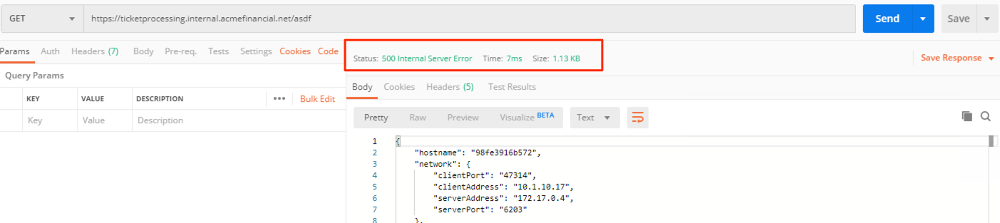
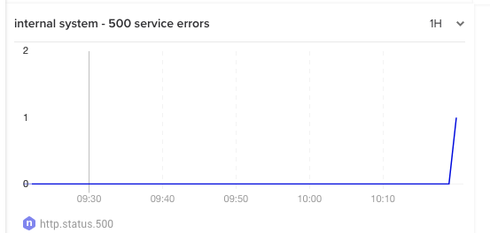
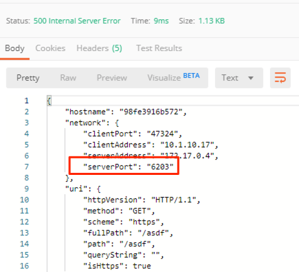
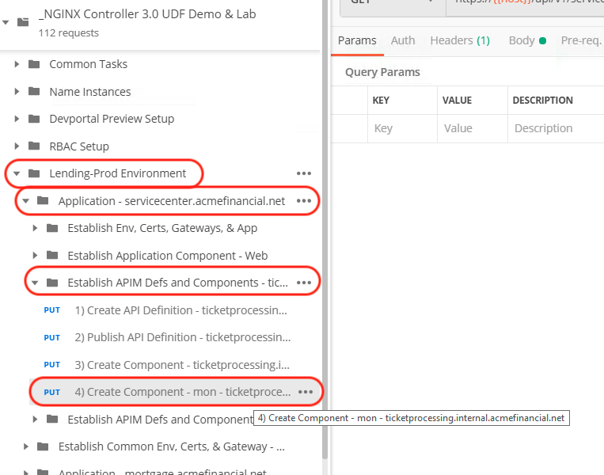

=====================================================================
Troubleshoot 500 errors in a large call center app
=====================================================================

+---------------------------------------------------------------------------------------------+
| Talk Track                                                                                  |
+=============================================================================================+
| Let's take a look at some of the problems with a large call center app Olivia is            |
| responsible for. The app is a complicated 3-tier application with internal services         |
| talking to each other. Olivia is getting reports from the call center agents that the app   |
| is having issues.                                                                           |
| We're going to troubleshoot to figure out what's going on. It looks like some of the issues |
| could be with the ticket processing service, but let's start by looking at the Controller   |
| dashboards to understand what's happening with the application and it's components.         |
+---------------------------------------------------------------------------------------------+

Log out as Samantha
^^^^^^^^^^^^^^^^^^^^^^

    1. Select the Controller GUI tab in Chrome
    2. Select `retail dev` in the top right
    3. Select |logout|

Log in as Olivia
^^^^^^^^^^^^^^^^^^^

    1. Login as Olivia using the credentials:
    
      - username: `lending-admin@acmefinancial.net`
      - password: `Admin123!@#`

Test the web site
^^^^^^^^^^^^^^^^^^^^

    1. Using Postman (in the JumpHost)
    2. Expand the `Traffic Tests` section
    3. Select the `ticketprocessing.internal.acmefinancial.net` request
    4. Select `Send` a few times
    5. Note that you will randomly receive a 500 response

|traffic_test_500_error_msg|

Review status codes
^^^^^^^^^^^^^^^^^^^^

    1. Go to the Controller GUI (using Chrome on the JumpHost)
    2. Open `Analytics` from the Navigation bar
    3. Select the `Lending-Prod` dashboard
    4. Scroll to the bottom and you to see the internal system - 500 service errors graph
    5. Note the 500 errors spikes

|traffic_test_500_error_msg_gui|

Identify where the 500 error is coming from
^^^^^^^^^^^^^^^^^^^^^^^^^^^^^^^^^^^^^^^^^^^

    1. Return to Postman (on the JumpHost)
    2. Click `Send` until you receive a 500 error
    3. Note the serverPort in the response: the 500 error only happens when the request is routed to a specific workload serverPort

|traffic_test_500_error_msg_serverport|

Triage a workaround
^^^^^^^^^^^^^^^^^^^

    1. Return to the Controller GUI
    2. Select `Services` from the Navigation bar
    3. Select the App `servicecenter.acmefinancial.net`
    4. Select the Component `ticketprocessing.internal.acmefinancial.net` and edit it
    5. Select `Workload Groups`
    6. Edit the `servers` workload group
    7. Edit the two backend workload URIs using port 6203

      1. Set "Is Down" to `True`
      2. Click Done

    8. Publish the changes

Test the web site again
^^^^^^^^^^^^^^^^^^^^^^^

    1. Using Postman (in the JumpHost)
    2. Expand the `Traffic Tests` section
    3. Select the `ticketprocessing.internal.acmefinancial.net` call
    4. Click `Send` a few times
    5. Note that you no longer receive a 500 response

Setting a Health monitor from the pipeline
^^^^^^^^^^^^^^^^^^^^^^^^^^^^^^^^^^^^^^^^^^

    1. Using Postman (in the JumpHost)
    2. Expand the `Lending-Prod Environment` section
    3. Expand `Application - servicecenter.acmefinancial.net`
    4. Expand `Establish APIM Defs and Components - ticketprocessing.internal.acmefinancial.net`
    5. Select `Create Component - mon - ticketprocessing.internal.acmefinancial.net`
    
    |monitor|
    
    6. Note the monitoring section
    7. Note that isDown is back to false for each workload URI
    8. Click on Send to push this configuration (PUT method)

Test the web site again
^^^^^^^^^^^^^^^^^^^^^^^

    1. Using Postman (in the JumpHost)
    2. Expand the `Traffic Tests` section
    3. Select the `ticketprocessing.internal.acmefinancial.net` call
    4. Select `Send` a few times
    5. Note that you no longer receive a 500 response

+---------------------------------------------------------------------------------------------+
| Talk Track                                                                                  |
+=============================================================================================+
| Olivia sees that the configuration changes have fixed the issues: servers are no longer     |
| tagged as down permanently.                                                                 |
| By adding monitoring to the configuration, NGINX can be responsible for health checking     |
| (actively or passively) ensuring the health and availability of the service.                |
+---------------------------------------------------------------------------------------------+

.. |logout| image:: ../../_static/log_out.png
   :scale: 50 %

   

