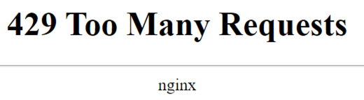

==============================================
Protecting your application with rate limiting
==============================================

There are reports to the mortgage team that some folks have had the inability to login.
The mortgage team has reported: "hey, our service is seeing some massive spike and CPU load."
So let's provide some relief to the mortgage team and take a look at the configuration of the 
mortgage application again we can see

The mortgage application in our pipeline has a couple of different components, a web login and 
web API endpoints

Create the configuration
^^^^^^^^^^^^^^^^^^^^^^^^

    1. Using Postman (in the JumpHost)
    2. Expand the `Lending-Prod Environment` section
    3. Expand `Application - mortgage.acmefinancial.net`
    4. Select `Create Component - login` and click Send
    5. Note that both the INGRESS URIs and WORKLOAD URIs are configured to use encryption

Insert rate limiting
^^^^^^^^^^^^^^^^^^^^

    1. Select `Create Component - login - with rate`
    2. Note the Security section and the rateLimit. The rate limit is set low ( 1 second ) to provide some relief.
    3. Click Send to push the configuration change (PUT method)

Test the Rate Limit configuration
^^^^^^^^^^^^^^^^^^^^^^^^^^^^^^^^^

    1. Open a tab in the web browser (in the JumpHost)
    2. enter the URL: https://mortgage.acmefinancial.net/login
    3. Refresh the page quickly a few times
    4. Note the 429 that is returned if you refresh the page too quickly

|rate_limiting_test|

==========
END OF LAB
==========