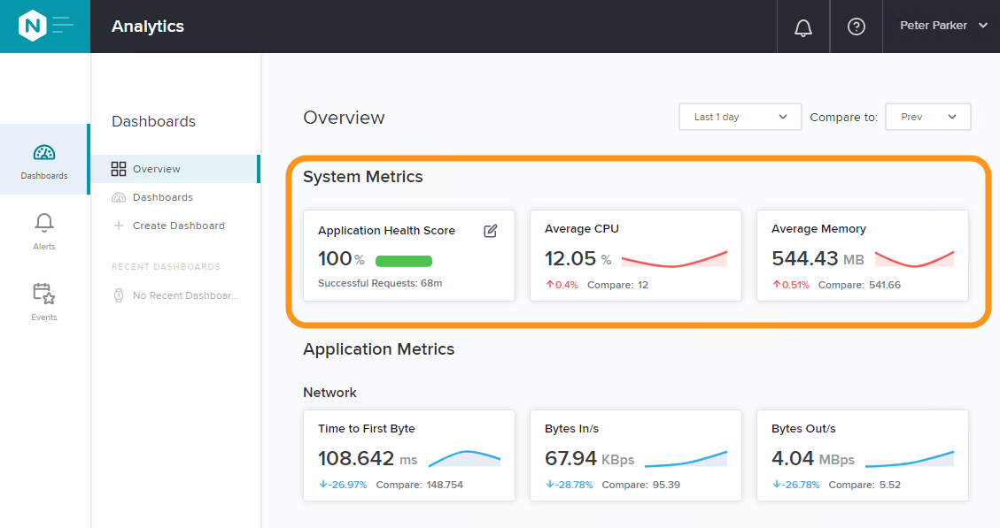
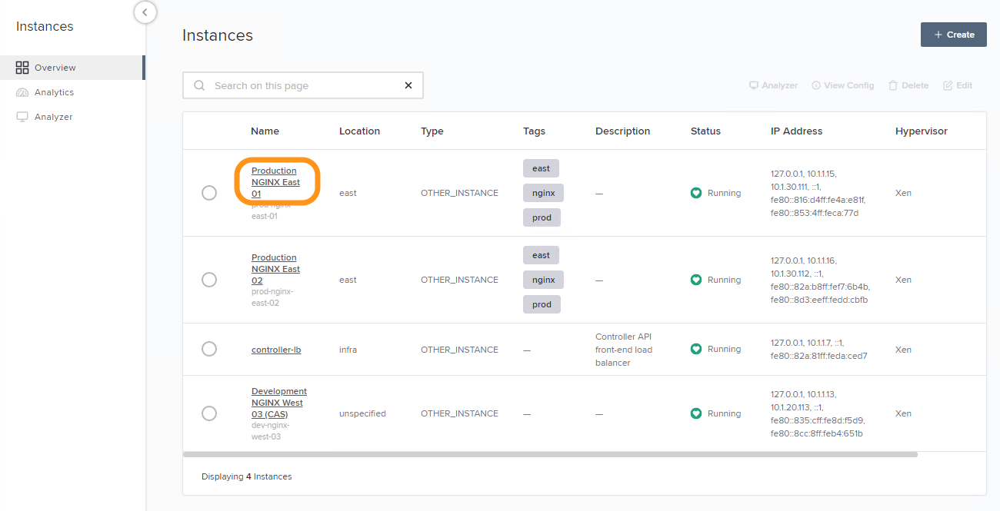
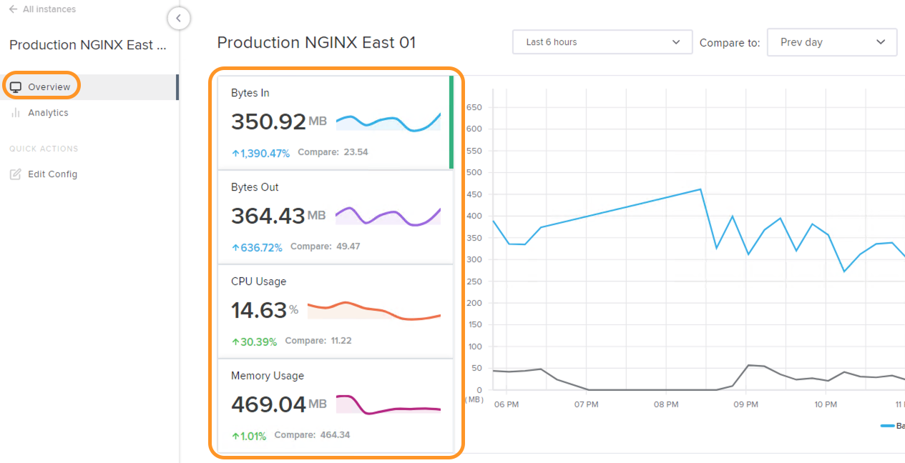
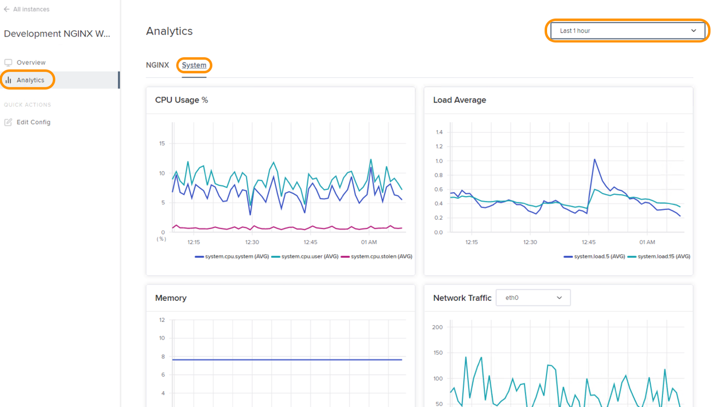

Lab 1 - Analytics for NetOps/Admin
############################################

The goal of this lab is to explore NGINX Plus instance statistics provided by NGINX Controller.
This category of analytics will be of interest to an organization's NetOps personas.

.. IMPORTANT::
    Estimated completion time: 5 minutes

.. NOTE::
    Lab instructions are written as if the student is executing the steps
    from the Windows jumphost -- ``jumphost-1``. See the :ref:`overview` for connection details.

Overview Dashboard
-------------------

#. Open Chrome Browser.
#. Access the NGINX Controller UI through the provided bookmark.

   .. image:: ./media/M1L1ControllerBookmark.png
      :width: 400

#. Login with the ``Peter Parker`` account who is an NGINX Controller admin.

   +-------------------------+-----------------+
   |      Username           |    Password     |
   +=========================+=================+
   | peter@acmefinancial.net | ``Peter123!@#`` |
   +-------------------------+-----------------+

   .. image:: ./media/M1L1ControllerLogin.png
      :width: 400

#. Notice the "Overview" dashboard is displayed on login. The "System
   Metrics" section, prominently located at the top of the "Overview", appeals to NetOps personas.

   |Lab1MainDashboard|

Instance Analytics
-------------------

#. Select the navigation bar in the upper left of the screen then select **Infrastructure** from the drop-down list.

   .. image:: ./media/M3L1Infra.png
      :width: 200

#. From the list of Instances, click on **Production NGINX East 01**. 
   This view is the "Instance Overview" page. Toggle the graphs
   from **Bytes In**, **Bytes Out**, **CPU Usage** and **Memory Usage** by clicking on the tiles.

   |Lab1InstanceSelection|

   |Lab1InstanceDashboard|

#. Click on **Analytics** to open the instance's detailed analytics.
   This section provides a single pane with all useful graphs for the selected instance.
   Toggle the time ranges from the right most drop-down box to see the instance performance for a
   particular time range.

   |Lab1InstanceAnalytics|

.. IMPORTANT::
   Though out of scope for this lab, please see the custom dashboard features under **Analytics -> Dashboards**.
   Dashboard elements can include aggregated and filtered views of the 100s of instance and application metrics collected by Controller.

.. |ControllerBtn| image:: media/0ControllerBtn.png
   :width: 1.59722in
   :height: 0.98611in
.. |Infrastructure| image:: media/0Infrastructure.png
   :width: 2.46535in
   :height: 0.53394in

