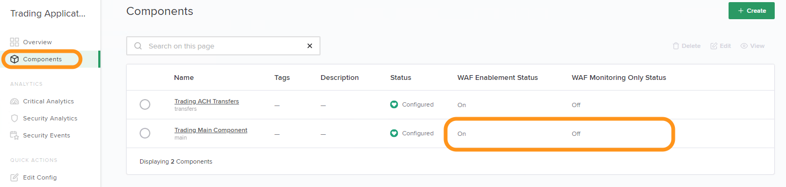

Lab 2 - Analytics for DevOps/Developer
################################################

The goal of this lab is to demonstrate the rich app and WAF analytics provided by Controller. 
This category of analytics will be of interest for DevOps and Developer personas who are responsible for individual Apps/Components.

.. IMPORTANT::
    Estimated completion time: 10 minutes

.. NOTE::
    Lab instructions are written as if the student is executing the steps
    from the Windows jumphost -- ``jumphost-1``. See the :ref:`overview` for connection details.

Overview Dashboard
--------------------

#. Open Chrome Browser.
#. Access the NGINX Controller UI through the provided bookmark.

   .. image:: ./media/M1L1ControllerBookmark.png
      :width: 400

#. Login with the ``Natasha Romanoff`` account who is an (unprivileged) NGINX Controller user.

   +---------------------------+-------------------+
   |      Username             |    Password       |
   +===========================+===================+
   | natasha@acmefinancial.net | ``Natasha123!@#`` |
   +---------------------------+-------------------+

   .. image:: ./media/M3L2natasha.png
      :width: 400

#. Notice the "Overview" dashboard is displayed on login. 
   The "Application Metrics" section within the default dashboard will be of
   interest to DevOps or Developer personas.

   |Lab2MainDashboard|

Critical Analytics
--------------------

#. Select the navigation bar in the upper left of the screen then select **Infrastructure** from the drop-down list.

   .. image:: ./media/M3L1Infra.png
      :width: 200

#. From the list of Instances, verify the **Development NGINX West 03(CAS)**
   instance is available. The infrastructure team has configured this NGINX Plus instance
   with NGINX App Protect (WAF).

   |image4|

   .. NOTE::
      The NGINX Controller instance used in this lab includes a license enabled "Controller Application Security" ("CAS"). 

#. Navigate to the **Services** menu and select the **Apps** tile.

   .. image:: ./media/M3L2services.png
      :width: 200

   .. image:: ./media/M3L2apps.png
      :width: 100

#. Open the **Trading Application (CAS)** app. The "Analytics" sections presented 
   here are "roll up" views of data from all "Components" of the "App". 

   .. image:: ./media/M3L2TradingRollup.png
      :width: 200

#. In this lab we want to view analytics data drilled down to the "Component" level. Select the **Components** section. 
   Notice the DevOps/Developers who own the "App" have permissions to enable/disable WAF (recall you are logged in as "Natasha" -- a member of "nginx-controller-users"). 
   
   |image6|

   .. NOTE:: 
      Controller allows a self-service approach for enabling WAF to protect configured apps.

#. Click the **Trading Main App** component and select
   **Critical Analytics** from the left navigation. In the **Breakout By** drop-down box (upper right)
   select **Request Outcome**. Note the "HTTP Requests" graph (located towards the bottom). 
   
   |image7|

   .. NOTE::
      Without CAS enabled, this graph would only include "all" requests.

#. Select **Security Analytics** from the navigation on the left. In the "WAF Metrics" section explore the two options under the drop-down box. 
    
   |image8|

   .. NOTE::
      The previous views allow for DevOps/Developers to quickly make WAF insights. 

#. Scroll down and explore the "WAF suspicious vs Normal Traffic" graph. 
   This view allows an operator to quickly see spikes in suspicious traffic over the selected time interval.
   Make sure you are only viewing the past 30 minutes (since we just started generating traffic in the last module).

   |image9|

#. Scroll down and explore the "Top URIs Targeted" list. This list depicts the top URIs targeted with attacks. 
   Tuning is available through options presented in the drop-down box on the right.

   |image10|

#. Scroll down to explore "WAF Top Threats" list. This list shows the WAF top threats based on **Attack Types** (default selection) or based
   on **Signatures**. Tuning is available through options presented in the drop-down box on the right.
    
   |image11|

   .. NOTE::
      Even with WAF set to monitor only mode, analytics data can be used to identify potential attacks. 
      Data can be sent to external systems such as Splunk or Datadog (feature currently in beta). 

#. Go to **WAF Tuning** tab within the "Security Analytics" section. This
   section depicts the top signatures for the selected time range.
   Click on one of the **signature IDs** to be taken to the "Security
   Events" section.

   |image12|

   .. NOTE::
      The "Top Signatures" view can be useful for identifying false positives. 

   |image13|

#. In the "Security Events" section, select one of the event records to show the
   "Event Details" tray. The HTTP request details are shown on the lower right.

   |image14|

#. In the "Event Details" tray, hover your mouse over **Remote Address** and click the **funnel** icon.
   This action creates an additional filter. Now the "Security Events" list is filtered on "signature ID" and "remote address".

   |image15|

   |image16|

   .. NOTE::
      Notice that many "Event Details" data points can be used as filters. 
      This powerful filtering feature allows for quick pattern detection.

.. |Lab2MainDashboard| image:: media/Lab2MainDashboard.png
   :width: 800
.. |ControllerBtn| image:: media/0ControllerBtn.png
   :width: 1.59722in
   :height: 0.98611in
.. |Infrastructure| image:: media/0Infrastructure.png
   :width: 2.46535in
   :height: 0.53394in
.. |image4| image:: media/image4.png
   :width: 800
.. |image5| image:: media/image5.png
   :width: 800

.. |image7| image:: media/image7.png
   :width: 800
.. |image8| image:: media/image8.png
   :width: 800

.. |image12| image:: media/image12.png
   :width: 800
.. |image13| image:: media/image13.png
   :width: 800
.. |image14| image:: media/image14.png
   :width: 800
.. |image15| image:: media/image15.png
   :width: 800
.. |image16| image:: media/image16.png
   :width: 800
