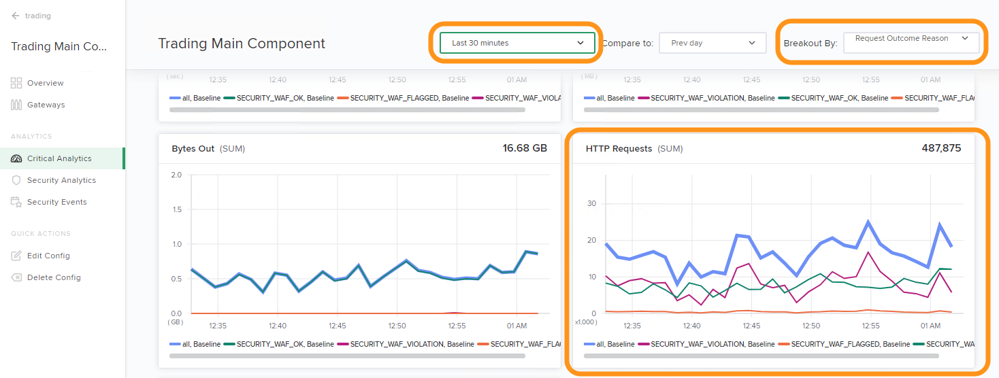

Lab 2 - Analytics for DevOps/Developer
################################################

The goal of this lab is to demonstrate the rich app and WAF analytics provided by Controller when the Controller App Security (CAS) is licensed and enabled.
This category of analytics will be of interest for DevOps and Developer personas who are responsible for individual Apps/Components.

.. IMPORTANT::
    Estimated completion time: 5 minutes

.. NOTE::
    Lab instructions are written as if the student is executing the steps
    from the Windows jumphost -- ``jumphost-1``. See the :ref:`overview` for connection details.

Overview Dashboard
--------------------

#. The jumphost should already have Chrome loaded with the controller UI at the login screen:

   .. image:: ../media/ControllerLogin.png
      :width: 400

#. If not, open Chrome Browser.

#. Access the NGINX Controller UI through the provided bookmark.

   .. image:: ../media/ControllerBookmark.png
      :width: 600

#. Login with the ``Natasha Romanoff`` account who is an (unprivileged) NGINX Controller user.

   +---------------------------+-------------------+
   |      Username             |    Password       |
   +===========================+===================+
   | natasha@acmefinancial.net | ``Natasha123!@#`` |
   +---------------------------+-------------------+

   .. image:: ../media/ControllerLogin-Natasha.png
      :width: 400

#. Notice the "Overview" dashboard is displayed on login. 
   The "Application Metrics" section within the default dashboard will be of
   interest to DevOps or Developer personas.

   |Lab2MainDashboard|

Critical Analytics
--------------------

#. Select the navigation bar in the upper left of the screen then select **Infrastructure** from the drop-down list.

   .. image:: ../media/Tile-Infrastructure.png
      :width: 200

#. From the list of Instances, verify the **Development NGINX West 03 (CAS)**
   instance is available. The infrastructure team has configured this NGINX Plus instance
   with NGINX App Protect (WAF).

   |image4|

   .. NOTE::
      The NGINX Controller instance used in this lab includes a license enabled "Controller Application Security (CAS)". 

#. Navigate to the **Services** menu.

   .. image:: ../media/Tile-Services.png
      :width: 200

#. Select the **Apps** tile.

   .. image:: ../media/Services-Apps.png
      :width: 200

#. Open the **Trading Application (CAS)** app. The "Analytics" sections presented 
   here are "roll up" views of data from all "Components" of the "App". 

   .. image:: ./media/M3L2TradingRollup.png
      :width: 200

#. In this lab we want to view analytics data drilled down to the "Component" level. Select the **Components** section. 
   Notice the DevOps/Developers who own the "App" have permissions to enable/disable WAF (recall you are logged in as "Natasha" -- a member of "nginx-controller-users"). 
   
   |image6|

   .. NOTE:: 
      Controller allows a self-service approach for enabling WAF to protect configured apps.

#. Click **Trading Main Component** and select
   **Critical Analytics** from the left navigation. In the **Breakout By** drop-down box (upper right)
   select **Request Outcome Reason**. Scroll down the page and note the "HTTP Requests (SUM)" graph located towards the bottom. 
   
   |image7|

   .. NOTE::
      Without CAS enabled, this graph would only include "all" requests. In the next module, we will explore the CAS feature.

.. |Lab2MainDashboard| image:: media/Lab2MainDashboard.png
   :width: 800
.. |ControllerBtn| image:: media/0ControllerBtn.png
   :width: 1.59722in
   :height: 0.98611in
.. |Infrastructure| image:: media/0Infrastructure.png
   :width: 2.46535in
   :height: 0.53394in
.. |image4| image:: media/image4.png
   :width: 800
.. |image5| image:: media/image5.png
   :width: 800
.. |image6| image:: media/image6.png
   :width: 800

