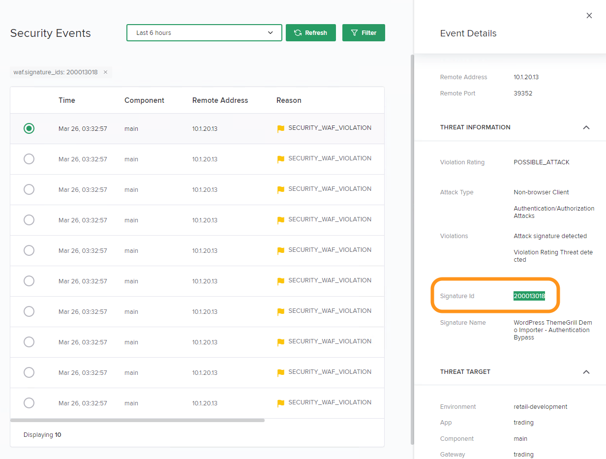

Lab 1 - Application Security (UI)
#################################

The goal of this lab is to explore the Controller Application Security module through the application of policy and includes the exploration of related events and metrics.

.. IMPORTANT::
    Estimated completion time: 12 minutes

.. NOTE::
    Lab instructions are written as if the student is executing the steps
    from the Windows jumphost -- ``jumphost-1``. See the :ref:`overview` for connection details.

Enable Security on a Component
------------------------------

#. Open Chrome Browser.

#. Access the NGINX Controller UI through the provided bookmark.

   .. image:: ../media/ControllerBookmark.png
      :width: 600

#. Login with the ``Natasha Romanoff`` account who is an (unprivileged) NGINX Controller user.

+---------------------------+-------------------+
|      Username             |    Password       |
+===========================+===================+
| natasha@acmefinancial.net | ``Natasha123!@#`` |
+---------------------------+-------------------+

    .. image:: ../media/ControllerLogin-Natasha.png
        :width: 400

#. Navigate to the **Services** menu.

    .. image:: ../media/Tile-Services.png
        :width: 200

#. Select the **Apps** tile.

    .. image:: ../media/Services-Apps.png
        :width: 200

#. Open the "Trading Application (CAS)" app. 

    .. image:: ./media/TradingMainCASApp.png
        :width: 600

#. The overview presented features aggregated views of data from all Components of the App.

    .. image:: ./media/TradingMainCASComponentOverview.png
        :width: 600

#. In this lab we want to enable the WAF on this component. Select the **Components** section, then click **Trading Main Component**.

    .. image:: ./media/TradingMainCASComponent.png
        :width: 600

#. Click the **Edit Component** button.

    .. image:: ./media/TradingMainCASEditComponent.png
        :width: 600

#. Click the **Security** link. Notice the WAF has not been enabled for this component. DevOps/Developers who own the "App" have permissions to enable/disable WAF (recall you are logged in as "Natasha" -- a member of "nginx-controller-users").
    
    .. NOTE:: 
        Controller allows a self-service approach for enabling WAF to protect configured apps.

#. Toggle the **Enable WAF** selector to turn it on. A Checkbox should appear in the toggle button.
    
    .. NOTE:: 
        Since we intend to first enable the WAF in the Retail Development environment, this represents minimal risk to the Acme Financial corporation. We will leave the **Monitor Only** selector off in this component.

    .. image:: media/TradingMainCASComponentEnableWAF.png
        :width: 800

#. Click the **Submit** button.
    Controller will configure WAF on the component. 

    .. image:: ../media/Submit.png
        :width: 100

    .. NOTE::
        When the WAF has been successfully configured on the component, you will see this:

        .. image:: ./media/TradingMainCASComponentConfigured.png
            :width: 600

Examine Security Analytics
--------------------------

#. In the "Trading Application (CAS)" app, select the **Components** section, then click **Trading Main Component**.

    .. image:: ./media/TradingMainCASComponent.png
        :width: 600

#. Click the **Security Analytics** link. This will display security-related insights for the currently selected Component.
        
    .. image:: ./media/TradingMainCASSecurityAnalytics.png
        :width: 600

#. Select the **Last 30 minutes** dropdown for this display. Scroll down to **WAF Suspicious vs Normal Traffic**. Since traffic generation has been running against this component, you should see graph data immediately. This view allows an operator to quickly see spikes in suspicious traffic over the selected time interval. Look for a spike in security events that may be appearing when compared to previous period (**Prev day** is selected by default). Hover your cursor over the graph and note the approximate time of this spike for use in the next step. 

    .. image:: media/TradingMainCASSecurityAnalyticsLast30.png
        :width: 800

#. Scroll down and explore the "Top URIs Targeted" list. This list depicts the top URIs targeted with attacks. Filtering is available through options presented in the drop-down box on the right.

    .. image:: media/AnalyticsTopURIs.png
        :width: 800

#. Scroll down to explore "WAF Top Threats" list. This list shows the WAF top threats based on **Attack Types** (default selection) or based on **Signatures**. Filtering is available through options presented in the drop-down box on the right.

    .. image:: media/AnalyticsTopThreats.png
        :width: 800

.. NOTE::
    Depending on the amount of event data, the "WAF Top Threats" list may take some time to load. 

.. NOTE::
    Even with WAF set to monitor only mode, analytics and event data can be used to identify potential attacks. 
    Data can be sent to external systems such as Splunk or Datadog.

Examine Security Events
-----------------------

#. In the **Trading Application (CAS)** app's **Components** menu, Click on the **Trading Main Component** link 

    .. image:: ./media/TradingMainCASComponent.png
        :width: 700

#. Click on **Security Events**. Here is where security events are being logged, complete with request details. 

    .. image:: ./media/TradingMainCASComponentEvents.png

#. Search by dates and times based on the observed range in the analytics graph. Click the dropdown which contains the value of **Last 24 hours** currently selected. Click **Last 5 minutes**. 

    .. image:: ./media/TradingMainCASComponentEventsLast5.png

#. To inspect the security events details, click on a particular row. The event details tray will appear from the right side of the window.

    .. image:: ./media/TradingMainCASComponentEventsDetails.png

#. Scroll down the details tray to the **REQUEST INFORMATION** section and locate the **Remote Address** field. Click on the **funnel** icon for this field. This action creates a filter. Now the "Security Events" list is filtered on "remote address".

    .. image:: ./media/TradingMainCASComponentEventsDetailsIP.png
        :width: 400

    .. NOTE::
        Notice that many "Event Details" data points can be used as filters. This powerful filtering feature allows for quick pattern detection.

#. You are be presented with a list of security events for a specific remote IP address. Based on the filtered list, does this look like a legitimate application user?

    .. image:: ./media/TradingMainCASComponentEventsDetailsIPFiltered.png

#. Click the **Security Analytics** link. Click the **WAF Tuning** link to view events by signature IDs.

    .. image:: ./media/TradingMainCASComponentTuning.png
    
#. Click on the signature with the ID of **200013018**. Notice a high percentage of violations. Could this perhaps be a request that is being blocked unintentionally? These are usually referred to as "false positives". 
    
#. Click the **View Events** button to examine the requests that triggered this signature to determine if this is a false positive.
    
    .. image:: ./media/TradingMainCASComponentTuningSelect.png

#. Scroll down in the event details tray to the **REQUEST** section. Note the highlighted portion of the **Details** as follows. This is the request:

    .. image:: ./media/TradingMainCASComponentEventsRequest.png

#. In Chrome, open a new tab and browse to the application using the request observed in the security event in question. The url to use is ``http://trading.acmefinancial.net/wp-admin/admin-post.php?do_reset_wordpress``. Observe the user experience when this request is made. What did you see? Notice a "support ID" appears in the response. This is an event correlation ID that also appears in the event details.

    .. image:: ./media/TradingMainCASComponentBlocked.png

#. The assumption for the purpose of this lab is that this request is a false positive. In the Controller Chrome tab, locate and copy the signature ID from the event details tray for use in the next section.

Tune the WAF policy
-------------------

#. Click **Edit Config** to edit the component's security configuration.

    .. image:: ./media/TradingMainCASComponentEventsQuickEdit.png
    
#. Click **Security** and paste the signature ID ``200013018`` into the "Disable Signatures" text box.
    
    .. image:: ./media/TradingMainCASComponentSignature.png

#. Click **Submit** to update the component's security policy.

    .. image:: ../media/Submit.png
        :width: 100

.. NOTE::
    When the WAF has been successfully configured on the component, you will see this:

#. Wait at least 30 seconds, then attempt the same request in your browser again. Note that the request is now permitted (although results in a 404 status result).

    .. image:: ./media/TradingMainCASComponentNotBlocked.png

