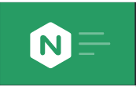
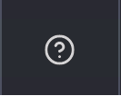
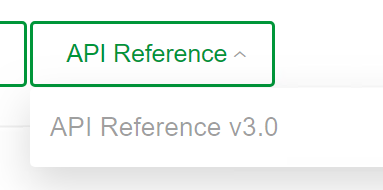
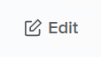
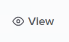
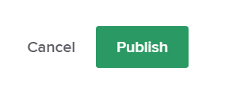

# NGINX Controller 3.x Lab Guide

=================================

ACME Financial was founded in 1965.
During the 1980 recession in America, ACME financial spun off to provide lending assistance for its customers. This created a lending business unit and in 2001 asked me financial increased to start focusing on the retail personal finance space.
In 2020 that retail space started to define a new trading platform.
In this exercise we will begin working within that space of two business units, the lending business unit and the retail space.
Within the team that we work with to engage with Controller was David a network engineer responsible for the overall NGINX Controller platform.
Responsible for some of the security and network routing core routing requirements within the DevOps space in the lending business unit.
Olivia, a DevOps engineer, responsible for curating the pipelines and the NGINX configuration. No more app centric delivery fashion within the
within that space as well is Tony an app developer responsible for some of the core service center applications.
In the other part of the organization in the retail business unit. 
We have Samantha who's been responsible for the DevOps engineering around building pipeline and getting the new trading and other apps available to that market space.

## Familiarize yourself with Controller as Samantha

Follow these steps to complete this task:

1. Login to Controller as Samantha
   1. Open the Controller web interface and logon using the username: retail-dev@ACMEfinancial.net with the password:  Admin123!@#

      

2. Review Samantha's view within Controller
   1. Select the navigation bar in the upper left of the screen. 
   2. Select the Services menu. 
      1. Under Services Samantha is restricted to three Apps supporting ACME Financial.
   3. Select the App named trading.acmefinancial.net
      1. Note the tray that opens on the right, showing the Components that have been configured for the application.
   4. Explore each Component to familiarize yourself with the full application.

    We can see at a glance the configuration state of the trading application and then go in and see what makes this application tick. What are the various components and pieces.

3. Explore the documentation

    Samantha is also becoming accustomed to the new API for controller. She is going to be able to use this new UX experience to both work visually with the product as well as seeing how to automate and use the new API that's available with Controller.

    1. From the Controller UI, select the help icon in the Navigation bar.  

        A new tab opens presenting the in-box documentation

    2. Select API Reference drop down
    3. Select the current version of the API Reference 

        Samantha now has a full API reference of how to use the various endpoints that are available and can walk through the various endpoints to be able to automate from login to creating and deploying new services.
        The two main endpoints that we will be working with are gateway and component

    4. In the left side of the API Reference select the gateways section and review the options.
    5. In the left side of the API Reference select the components section and review the options.

        In both cases note the object based path to interact with these objects.  For example: a Component is an object that is a child to an App which is a child to an environment.
        `https://10.1.1.5/api/v1/services/environments/{environmentName}/apps/{appName}/components`

4. Explore API actions in the GUI while editing

    1. From the Controller GUI web browser tab
    2. Select the trading.acmefinancial.net App
    3. Select Edit 
    4. at the bottom of the edit screen select VIEW API REQUEST to review the API used to create or modify this App object.  
    5. Note the API call, the JSON body, and the copy to clipboard icon all added to enable quick and easy GUI discovery and translation to automation.

## Extending the Trading application through exposing referral and upload capabilities.

Samantha is responsible for the trading application has found that it's been extremely successful and adopted by the retail customers are looking to move fast.
App teams are running a rolling out new parts of the application using modern application development processes. So what we're going to see is the deployment of new financial transfer functions.
A referral program as well as some upload capabilities within the, within the controller space. So let's go ahead and begin these changes.

1. Explore the trading application
   1. Using Google Chrome, open a new tab
   2. Enter 'https://trading.dev.acmefinancial.net` as the URL
   3. Select Login
   4. enter the username: admin with the password iloveblue
   5. Note the dashboard, as we enable new features the dashboard will change, displaying these new capabilities.

2. Define a new Transfers Component of the trading.acmefinancial.net application
   1. In the Controller GUI return to the Apps section
   2. Select the App trading.acmefinancial.net
   3. Select the View icon  to see the full list of Components for the App
   4. Select Create Component 
   5. enter the name: trading-transfers
   6. enter the display name: Trading Transfers Component
   7. Select Next
   8. Select the Gateway: trading.acmefinancial.net
   9. Select Next
   10. Enter the URI: /api
   11. Select Next (skipping Methods, and Advanced sections)
   12. Add a workload group
   13. Workload Group Name: app2-servers
   14. Add Backend Workload URI: http://10.1.20.21:9804
   15. Select Publish to create the transfers capability. 
   16. Observe the Status of the Component change from Configuring to Configured to indicate it is live.

    A dev ops team or in this ACME financial organization David's responsible for the network and certificate management within the financial organization. David's team established the trading gateway for Samantha to support this new component.

    As you can see the UI space is really flexible and powerful for various scenarios or use cases within Controller, whether it's basic URI routing,  SNI routing, or a combination. This example was very basic URI routing.
    The objective of this component is to route to the servers on which the particular component code runs, this is the workload group.  A workload group is the collection of servers or upstreams.

    Controller is responsible for getting the desired configuration that we specified thorugh the GUI or the API and getting it to the actual NGINX instance to process traffic.

3. review the new section of the Trading application
   1. Return to the tradigin application browser tab and refresh the page
   2. Note the new capability that has been added to the right hand side of the applicaton.

